# Hi, I'm Yuzen 👋

> Student developer · Taiwan

Information Management student at **National Taichung University of Science and Technology (NTCUST)**, building full-stack systems end-to-end — from authentication flows and real-time pipelines to RAG-powered AI applications and browser extensions.

I build the part of the system you only notice when it's gone.

---

## 🔭 Currently Focused On

- **Agentic AI & RAG** — retrieval-augmented generation, tool-calling agents, multi-modal pipelines
- **Real-time systems** — event-driven architecture, pub/sub patterns, latency optimization
- **Authentication & security** — JWT, session management, middleware design
- **Frontend performance** — rendering strategy, bundle optimization, perceived performance
- **Accessible technology** — building inclusive systems with map/navigation interfaces

---

## 🛠️ Tech Stack

**Proficient**

**Familiar**

---

## 🚀 Featured Projects

 🌟 Featured Projects

 ### accessible-smart-map — Multi-modal accessible navigation & real-time
 transit platform

 A full-stack accessible navigation system for Taipei that computes
 barrier-free routes and integrates live public transit data for
 mobility-impaired users and wheelchair travelers.

 
 
 
 
 
 

 What I built & why it's interesting:
 - Custom multi-modal routing engine integrated with OTP2 and Valhalla on
   OpenStreetMap network graphs, actively avoiding steep slopes, stairs, and
   unramped obstacles rather than relying on generic pedestrian paths
 - Real-time transit integration consuming TDX Open APIs for live bus arrival
   tracking, elevator availability, and metro accessibility alerts
 - Decoupled client-server architecture (frontend + REST backend) containerized
   via Docker for reproducible deployments across varying geo-routing runtimes
 - AI voice & RAG assistance with a bidirectional voice bridge and ChromaDB
   vector store, enabling hands-free, natural-language query resolution for
   barrier-free point-of-interest information

 ---

 ### graph-patent-analysis — Automated patent knowledge graph extraction &
 competitive intelligence

 An interactive visual analytics platform that transforms raw patent Excel
 datasets into multi-layer competitive knowledge graphs.

 

 What I built & why it's interesting:
 - Three-layer knowledge graph architecture modeling relationships across
   Applicant → Patent → Technical Concept to uncover hidden competitor overlaps
   and technology clusters
 - LLM-driven concept extraction leveraging Gemini to ingest unstructured
   patent abstracts and claims, structuring them into normalized semantic
   keywords in seconds
 - Client-side interactive graph exploration with dynamic node filtering,
   community clustering, and time-series patent evolution mapping without
   full-page remounts
 - High-throughput data ingestion handling bulk .xlsx parsing and in-memory
   graph construction, replacing hours of manual patent landscape analysis

 ---

 ### MakeNTU2026 — Deterministic divination engine meets voice-enabled
 Agentic RAG (Hackathon)

 An AI-powered strategic decision assistant combining deterministic ancient
 algorithmic logic with modern Agentic RAG and real-time voice interaction.

 
 
 
 
 
 

 What I built & why it's interesting:
 - Deterministic state engine implementing traditional Mei Hua I Ching
   divination without LLM hallucination — guarantees 100% reproducible Hexagram
   states and Five-Element (Wu Xing) risk scores
 - Agentic RAG pipeline retrieving contextual ancient commentaries and domain
   knowledge from ChromaDB based on active hexagram dynamics and query intent
 - Single-turn LLM synthesis constrained to strict JSON schemas, generating
   actionable 4-part decision reports with zero latency waste
 - Voice-first interaction integrating Whisper for transcription and
   server-side streaming speech synthesis for an end-to-end voice assistant
   workflow

---

 ### TermExpander-ai — Chrome extension for normalizing academic terminology

 A Manifest V3 browser extension designed for academic research and technical
 writing that instantly standardizes acronyms and professional terminology.

 

 

 What I built & why it's interesting:
 - In-page contextual tooltip that triggers on text selection, sending
   highlighted snippets to the Gemini API and rendering standardized academic
   notation ([Full Name (English, Abbr)]) directly adjacent to the cursor
 - BYOK (Bring-Your-Own-Key) architecture storing API keys securely in
   chrome.storage.local without intermediate backend servers, guaranteeing zero
   user data retention and zero infrastructure cost
 - Academic tone rewriting that transforms colloquial or informal phrasing into
   peer-review-ready technical prose in real time
 - Lightweight Manifest V3 implementation engineered for zero DOM layout
   interference and minimal memory overhead on dense research papers
---

## 📊 GitHub Stats

  

<table width="100%" align="center">
  <tr>
    <td width="50%" align="center">
      
    </td>
    <td width="50%" align="center">
      
    </td>
  </tr>
</table>

---

## 📬 Get in Touch

- 🌐 Website — [yuzen.dev](https://www.yuzen.dev)
- 💬 Discord — [@yuzen](https://discord.com/users/994875175885611018)
- 📸 Instagram — [@zn._.622](https://www.instagram.com/zn._.622/)

Always open to collaborating on interesting projects, discussing system design, or exploring internship opportunities.

Thanks for stopping by ☕
