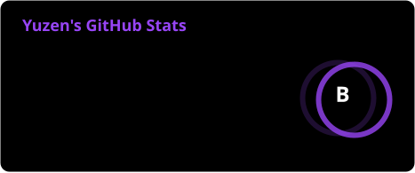
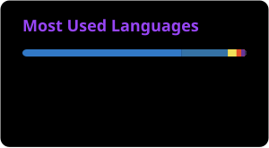

# Hi, I'm Yuzen 👋

> Student developer · Taiwan

Information Management student at **National Taichung University of Science and Technology (NTCUST)**, building full-stack systems end-to-end — from accessible navigation and native mobile apps to tool-calling AI agents, knowledge graphs, and research tools.

I build the part of the system you only notice when it's gone.

---

## 🔭 Currently Focused On

- **Agentic AI & RAG** — tool-calling agents, n8n workflows, vector retrieval, and voice interaction
- **Real-time systems** — event-driven architecture, pub/sub patterns, latency optimization
- **Authentication & security** — JWT, session management, middleware design
- **Frontend performance** — rendering strategy, bundle optimization, perceived performance
- **Accessible technology** — multimodal routing, real-time transit, and inclusive web/mobile navigation
- **Research tools & knowledge graphs** — patent concept extraction, community analysis, and citation workflows

---

## 🛠️ Tech Stack

**Proficient**

**Familiar**

**Also used in recent projects**

Vector search with **pgvector / ChromaDB**, mapping with **MapLibre / OpenStreetMap**, and graph analysis with **Graphology / Louvain**.

---

## 🚀 Featured Projects

### 💬 [chat.to](https://github.com/yuzen9622/chat.to) — Real-time chat, built the way modern chat should be

A full-featured real-time chat application with group rooms, typing indicators, and media uploads.

**Stack:** Next.js · TypeScript · Supabase · Ably · NextAuth · Cloudinary

**What I built & why it's interesting:**

- **Real-time via Ably pub/sub** instead of rolling my own WebSocket server — lets the app scale horizontally on Vercel's serverless runtime without long-lived connections on the origin
- **Session-based auth with NextAuth**, integrated into API routes and Ably channel authorization so users can only subscribe to rooms they belong to
- **Media uploads offloaded to Cloudinary** via signed uploads, keeping large payloads out of the API layer entirely
- **Typing indicators** implemented as ephemeral Ably presence events (not persisted) — a deliberate trade-off between UX fidelity and DB write pressure

---

### 🗺️ [accessible-smart-map](https://github.com/yuzen9622/accessible-smart-map) — 無障礙智慧導航系統

An accessible navigation platform combining web and native mobile clients with multimodal routing, transit information, and AI assistance.

**Stack:** Next.js · TypeScript · Express · MongoDB · OpenTripPlanner · Valhalla · Gemini · ChromaDB · Docker

**What I built & why it's interesting:**

- **Accessibility-aware route planning** integrating OpenTripPlanner and Valhalla with OpenStreetMap data, accounting for stairs, slopes, transfers, and elevator availability
- **Real-time transit integration** using TDX data for bus arrivals, low-floor bus information, and transit alerts
- **AI chat and voice assistance** connecting tool calls, accessibility knowledge retrieval, and a bidirectional Gemini Live voice bridge
- **Separate web, API, and mobile projects** sharing backend services while supporting platform-specific map and navigation experiences

🔗 [Web](https://github.com/yuzen9622/accessible-smart-map) · [Backend](https://github.com/yuzen9622/accessible-smart-map-backend) · [Mobile](https://github.com/yuzen9622/accessible-smart-map-mobile)

#### 📱 Native mobile companion

Built with **Expo · React Native · Expo Router · MapLibre Native**, with background navigation, rerouting, voice interaction, and platform-specific navigation notifications. The mobile project also includes accessibility preferences, hazard reporting, and SOS flows.

---

### 🔬 [graph-patent-analysis](https://github.com/yuzen9622/graph-patent-analysis) — Patent knowledge graphs & visual analytics

A research platform that turns patent Excel datasets into interactive **Applicant → Patent → Concept** graphs.

**Stack:** Next.js · TypeScript · Gemini · PostgreSQL · vis-network · Graphology

**What I built & why it's interesting:**

- **LLM-assisted concept extraction** from patent abstracts, with links back to source patents for inspection
- **Co-occurrence networks and Louvain communities** that distinguish empirical patent support from optional LLM-extracted semantic relations
- **Interactive research views** for concept networks, patent context, and side-by-side portfolio comparisons, with year and IPC filters
- **Research exports** including Excel/CSV data and self-contained HTML snapshots for offline exploration

---

### 🎓 [nutc-n8n-agent](https://github.com/yuzen9622/nutc-n8n-agent) — LINE campus assistant

A campus assistant for National Taichung University of Science and Technology, combining public-information retrieval with authorized personal school queries through LINE and LIFF.

**Stack:** TypeScript · Node.js · n8n · Gemini · PostgreSQL · pgvector · LINE Messaging API · LIFF · Docker

**What I built & why it's interesting:**

- **Native n8n AI Agent workflows** connecting model-selected tools, public knowledge retrieval, and conversation memory
- **Public-information RAG** using official HTML/PDF sources, Gemini embeddings, and pgvector retrieval
- **Per-user school sessions** bound through LIFF, with encrypted cookie storage and revocation when users unlink their accounts
- **Durable asynchronous replies** separating LINE event handling from longer-running agent tasks

---

### 📚 [cite-for-all](https://github.com/yuzen9622/cite-for-all) — Academic citations from DOIs & paper titles

A citation tool supporting APA, MLA, Chicago, Harvard, IEEE, Vancouver, and BibTeX, with batch conversion and saved reference projects.

**Stack:** Next.js · TypeScript · PostgreSQL · Prisma · Citation.js · citeproc-js · Docker

**What I built & why it's interesting:**

- **Metadata resolution** through DOI.org, Crossref, and DataCite, with exact DOI or normalized-title matching before generating a citation
- **Local citation formatting** using CSL styles, so switching formats does not require another metadata lookup
- **Batch failure isolation** that preserves successful results when individual papers cannot be resolved
- **Reference workflows** with text, BibTeX, and RIS exports, plus authenticated private projects

---

### 🤖 [MakeNTU2026](https://github.com/yuzen9622/MakeNTU2026) — 易策 Yi-Agent (hackathon)

A team-built MakeNTU 2026 project combining a deterministic Mei Hua I Ching engine with retrieval-augmented explanations and voice interaction.

**Stack:** TypeScript · React · Python · FastAPI · ChromaDB · faster-whisper

**Project highlights:**

- **Deterministic hexagram computation** keeps the symbolic calculation separate from model-generated interpretation
- **Contextual retrieval** uses hexagrams and domain keywords to retrieve relevant commentary from ChromaDB
- **Structured LLM output** organizes the explanation into summary, reading, advice, and timing
- **Voice interaction** combines speech transcription and streaming speech synthesis through WebSocket communication

---

### 🔤 [TermExpander-ai](https://github.com/yuzen9622/TermExpander-ai) — Chrome extension for academic terminology

Highlight a term on a webpage to expand acronyms, standardize terminology, and refine academic phrasing in a contextual tooltip.

**Stack:** TypeScript · React · Vite · Tailwind CSS · Chrome Extension (Manifest V3) · Gemini API

**What I built & why it's interesting:**

- **In-page terminology assistance** keeps the result next to the selected text for a focused reading workflow
- **Bring-your-own-key setup** stores the API key in `chrome.storage.local` and calls Gemini without an intermediary developer server
- **Academic writing support** combines acronym expansion, cross-language terminology, and tone refinement

---

## 📊 GitHub Stats

  

<table width="100%" align="center">
  <tr>
    <td width="50%" align="center">
      
    </td>
    <td width="50%" align="center">
      
    </td>
  </tr>
</table>

---

## 📬 Get in Touch

- 🌐 Website — [yuzen.dev](https://www.yuzen.dev)
- 💬 Discord — [@yuzen](https://discord.com/users/994875175885611018)
- 📸 Instagram — [@zn.\_.622](https://www.instagram.com/zn._.622/)

Always open to collaborating on interesting projects, discussing system design, or exploring internship opportunities.

Thanks for stopping by ☕
